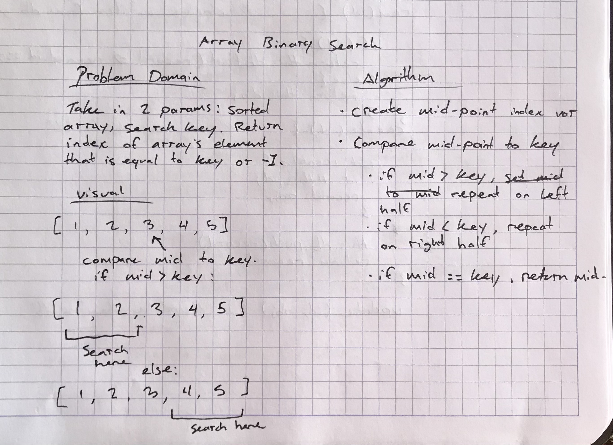

# Challenge Summary
<!-- Overall Summary -->
Return index of array's element equal to search key, or -1 if key not present.

## Challenge Description
<!-- Description of the challenge -->
Write a function called BinarySearch which takes in 2 parameters: a sorted array and the search key. Without utilizing any of the built-in methods available to your language, return the index of the array’s element that is equal to the search key, or -1 if the element does not exist.

## Approach & Efficiency
<!-- What approach did you take? Why? What is the Big O space/time for this approach? -->
My approach was firstly to try and remember the phone book analogy from an introduction to search algorithms. By checking the middle of the array against the key, we can then either move to the left or the right depending on the value, and search again. This has the nice benefit of halving our values to search at each step, assuming we have a sorted list.

[Referenced Wikipedia](https://en.wikipedia.org/wiki/Binary_search_algorithm)
## Solution
<!-- Embedded whiteboard image -->

