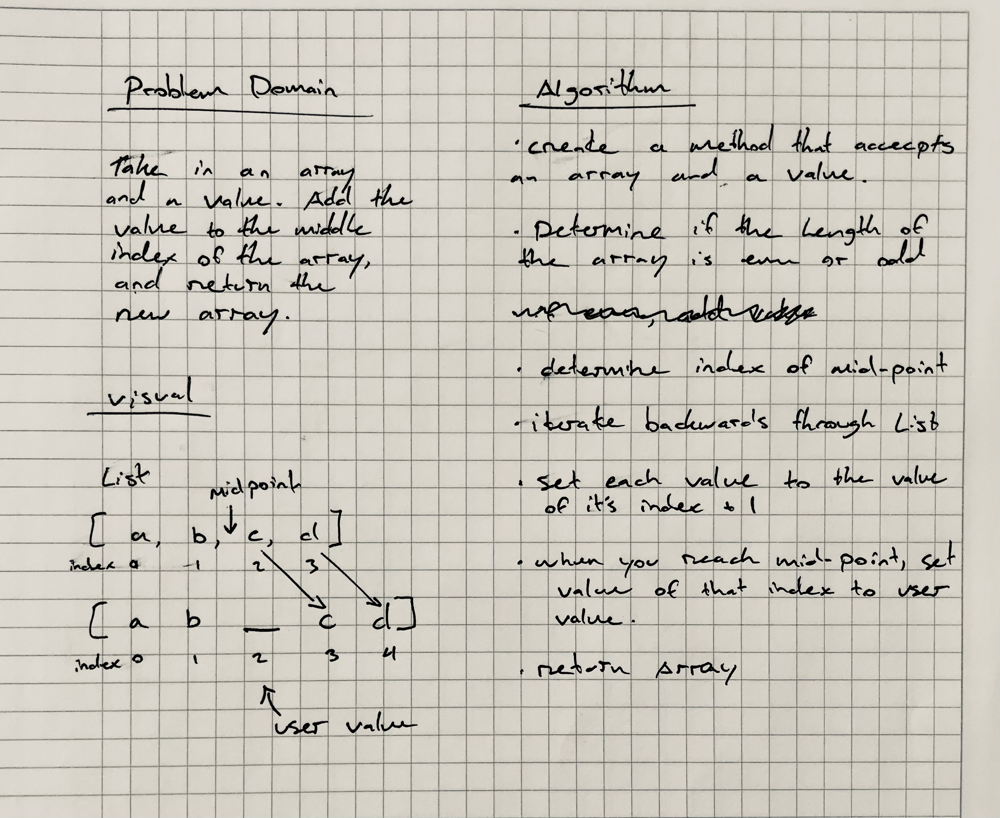

# Challenge Summary

Insert and shift an array in middle at index

## Challenge Description
<!-- Description of the challenge -->
Write a function called insertShiftArray which takes in an array and the value to be added. Without utilizing any of the built-in methods available to your language, return an array with the new value added at the middle index.

## Approach & Efficiency
<!-- What approach did you take? Why? What is the Big O space/time for this approach? -->
My approach was to calculate the middle index of the given array using `array.length`, the iterate backwards through the array to that point. At each index, move the value currently stored at the index to one slot over (index + 1), effectively lengthening the second half of the array by a single index value.

When the middle index is reached, set that value to the given insertion value.

## Solution
<!-- Embedded whiteboard image -->

