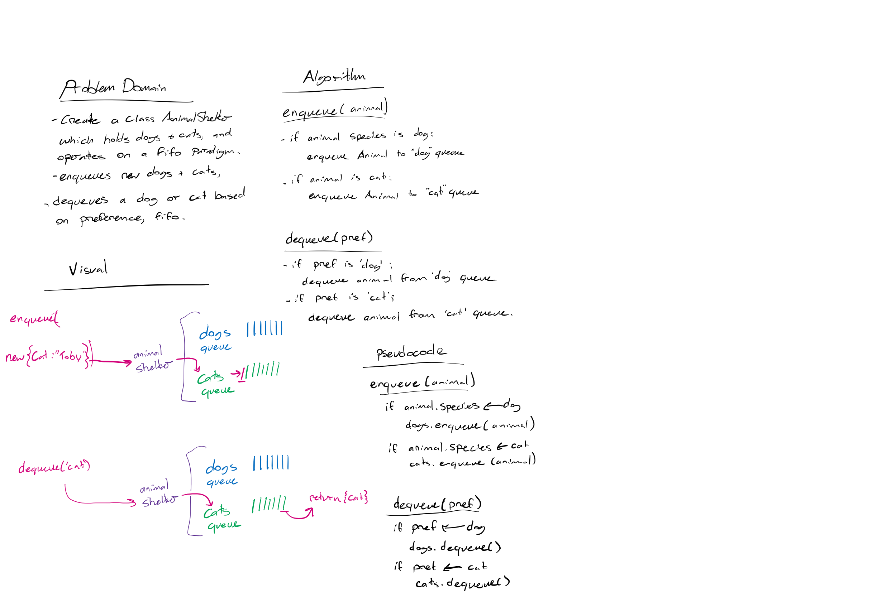

# Challenge Summary

Implement an Animal shelter that takes dog and cat objects, and enqueues and dequeues them on a FIFO principle.

## Challenge Description
<!-- Description of the challenge -->
Create a class called `AnimalShelter` which holds only dogs and cats. The shelter operates using a first-in, first-out approach.
Implement the following methods:
`enqueue(animal)`: adds animal to the shelter. animal can be either a `dog` or a `cat` object.
`dequeue(pref)`: returns either a dog or a cat. If `pref` is not "`dog`" or "`cat`" then return `null`.

## Approach & Efficiency
<!-- What approach did you take? Why? What is the Big O space/time for this approach? -->
For queueing, I used an if statement to determine the species of the animal object being added, then directed that object to be added to either a 'dogs' queue, or a 'cats' queue.

For dequeueing, I simply called my dequeue() function on the preferred animal's queue. Both these functions should operate with an O(1) efficiency, as they simply implement Queue objects.

## Solution
<!-- Embedded whiteboard image -->

