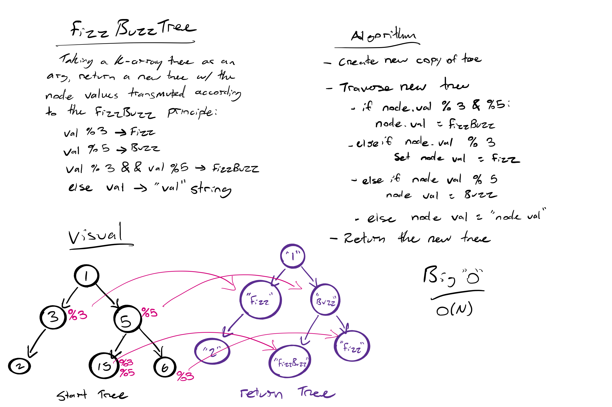

# Challenge Summary
<!-- Short summary or background information -->

Conduct “FizzBuzz” on a k-ary tree while traversing through it to create a new tree.

Set the values of each of the new nodes depending on the corresponding node value in the source tree.

## Challenge Description
<!-- Description of the challenge -->
Write a function called `FizzBuzzTree` which takes a k-ary tree as an argument.

Without utilizing any of the built-in methods available to your language, determine whether or not the value of each node is divisible by 3, 5 or both. Create a new tree with the same structure as the original, but the values modified as follows:

- If the value is divisible by 3, replace the value with “Fizz”

- If the value is divisible by 5, replace the value with “Buzz”

- If the value is divisible by 3 and 5, replace the value with “FizzBuzz”

- If the value is not divisible by 3 or 5, simply turn the number into a String.

Return a *new* tree.

## Approach & Efficiency
<!-- What approach did you take? Why? What is the Big O space/time for this approach? -->
I decided to approach this problem by first copying the input tree, the traversing the tree using a recursive walk function. At each node, I evaluate the value of the node and alter that value based on the FizzBuzz rules. This uses a time and space complexity of O(n) as it must evaluate every node in the tree once.

## Solution
<!-- Embedded whiteboard image -->

