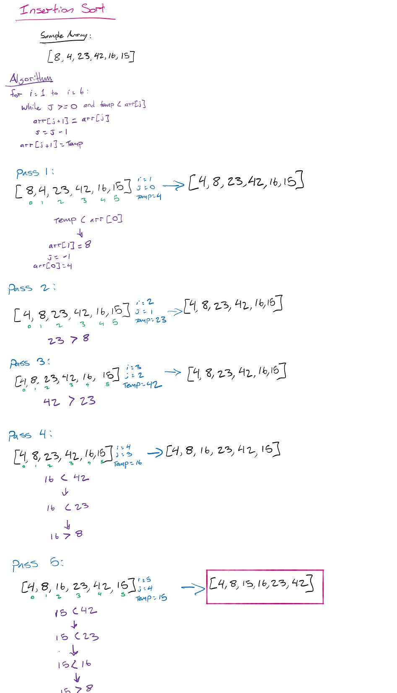

# Insertion Sort

Insertion sort is a sorting algorith that works through an array from start to end, sorting each sub-array iteratively from `arr[0 - 1]` through arr`[0 - arr.length. On every pass, it places the 'following' array item into sorted order, effectively sorting the array item by item from start to end.

Below, algorithm logic is shown in purple, each pass parameters are shown in blue, and output arrays for each pass are shown on the right. The final sorted array is in pink at the bottom.

