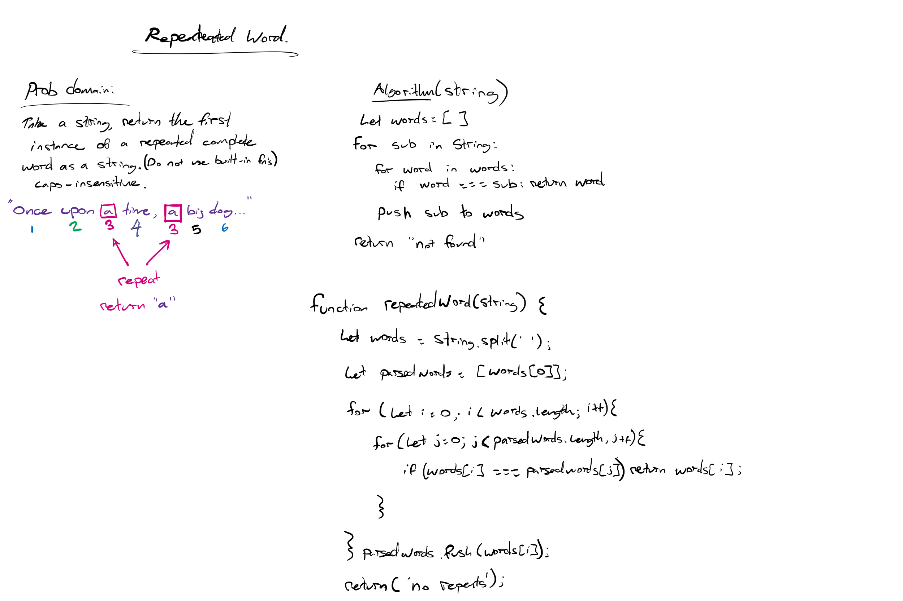

# Left Join
<!-- Description of the challenge -->
Write a function that LEFT JOINs two hashmaps into a single data structure.

The first parameter is a hashmap that has word strings as keys, and a synonym of the key as values.

The second parameter is a hashmap that has word strings as keys, and antonyms of the key as values.

Combine the key and corresponding values (if they exist) into a new data structure according to LEFT JOIN logic.

LEFT JOIN means all the values in the first hashmap are returned, and if values exist in the “right” hashmap, they are appended to the result row. If no values exist in the right hashmap, then some flavor of NULL should be appended to the result row.

The returned data structure that holds the results is up to you. It doesn’t need to exactly match the output below, so long as it achieves the LEFT JOIN logic.

Avoid utilizing any of the library methods available to your language.

Modify your function to return a count of each of the words in the provided string

Modify your function to return a list of the words most frequently used in the provided string

## Whiteboard Process
<!-- Embedded whiteboard image -->

## Approach & Efficiency
<!-- What approach did you take? Why? What is the Big O space/time for this approach? -->
I used a nested for loop to compare the current word in the string with an array of 'parsed words' that have already been checked. This results in a simple function with an O(n^2) worst-case scenario.

## Solution
<!-- Show how to run your code, and examples of it in action -->

