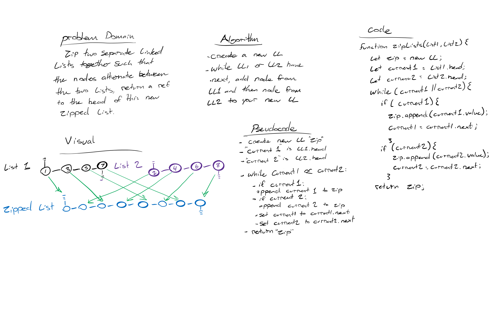

# Challenge Summary

Zip together two linked lists into a single list with alternating nodes from list1 and list2

## Challenge Description
<!-- Description of the challenge -->
Write a function called zipLists which takes two linked lists as arguments. Zip the two linked lists together into one so that the nodes alternate between the two lists and return a reference to the head of the zipped list. Try and keep additional space down to O(1). You have access to the Node class and all the properties on the Linked List class as well as the methods created in previous challenges.

## Approach & Efficiency
<!-- What approach did you take? Why? What is the Big O space/time for this approach? -->
My approach was to create a new empty list, then traverse through both given lists. On each iteration, I would add the current value from list1, then list2 to my new list. When both given lists are exhausted, return the new list.

## Solution
<!-- Embedded whiteboard image -->

