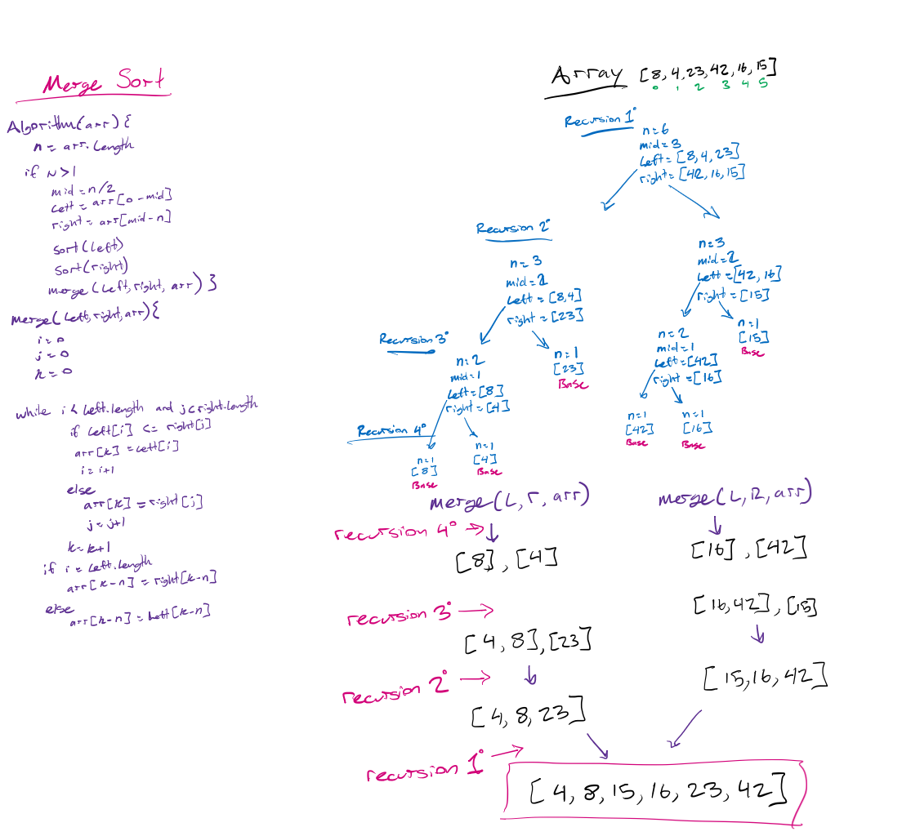

# Merge Sort

A merge sort uses recursion to iteratively divide an array into smaller and smaller sub-arrays, until each sub-array has only one component. At this point, it calls a merging function on it with the next constituent sub-array, which compares the contents of each sub-array as it replaces them into the larger combined array.

After this base case, it works it's way back down the call stack, until we are returned a complete, sorted array.

