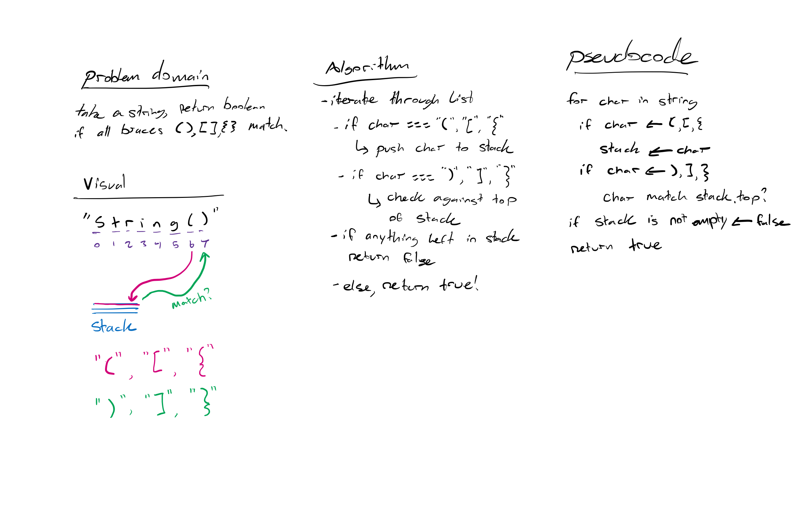

# Challenge Summary

Multi-bracket Validation.

## Challenge Description
<!-- Description of the challenge -->
Your function should take a string as its only argument, and should return a boolean representing whether or not the brackets in the string are balanced. There are 3 types of brackets:

Round Brackets : `()`

Square Brackets : `[]`

Curly Brackets : `{}`

## Approach & Efficiency
<!-- What approach did you take? Why? What is the Big O space/time for this approach? -->
First, I iterated through the string of characters.
I used a stack to collect all opening braces, then at each closing brace I popped the most recent opening brace off the stack. If the opening and closing braces match, continue through the string.

If all braces match at the end of the string, return true. This has an O(n) as it must iterate though the entire string.

## Solution
<!-- Embedded whiteboard image -->

