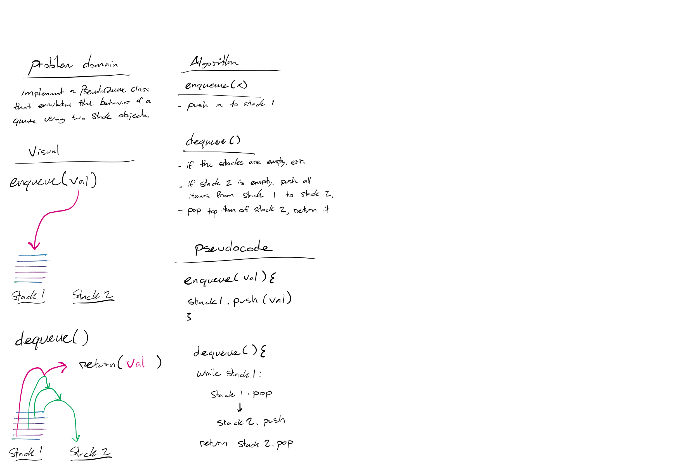

# Challenge Summary

Implement a Queue using two Stacks.

## Challenge Description
<!-- Description of the challenge -->
Create a brand new `PseudoQueue` class. Do not use an existing Queue. Instead, this PseudoQueue class will implement our standard queue interface (the two methods listed below), but will internally only utilize 2 `Stack` objects. Ensure that you create your class with the following methods:

`enqueue(value)` which inserts value into the PseudoQueue, using a first-in, first-out approach.

`dequeue()` which extracts a value from the PseudoQueue, using a first-in, first-out approach.

The Stack instances have only `push`, `pop`, and `peek` methods. You should use your own Stack implementation. Instantiate these Stack objects in your PseudoQueue constructor.

## Approach & Efficiency
<!-- What approach did you take? Why? What is the Big O space/time for this approach? -->
I utilized the second stack as a sort of 'buffer', which allowed me to temporarily store the values from my enqueued stack 1 in order to pop the bottom items off for my dequeue() function. 

This results in a O(n) operation for dequeue(), and an O(1) operation for enqueue, as you must iterate through the entire stack twice in order to dequeue a given item.

## Solution
<!-- Embedded whiteboard image -->

