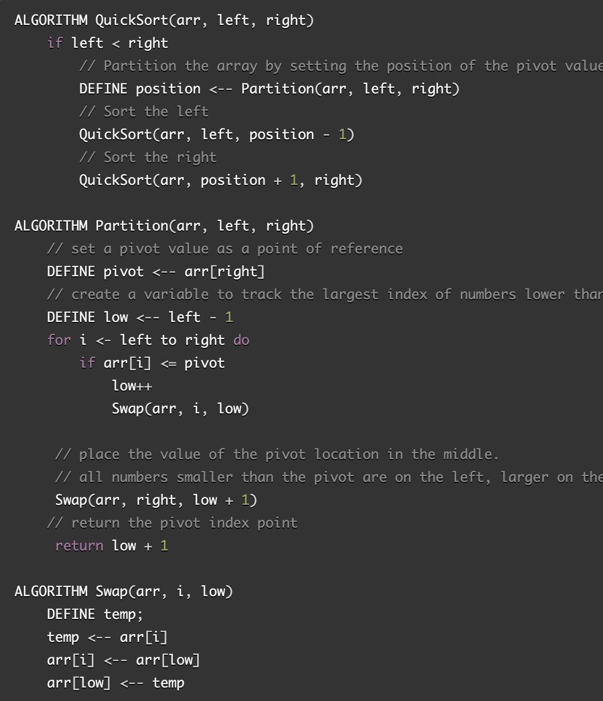
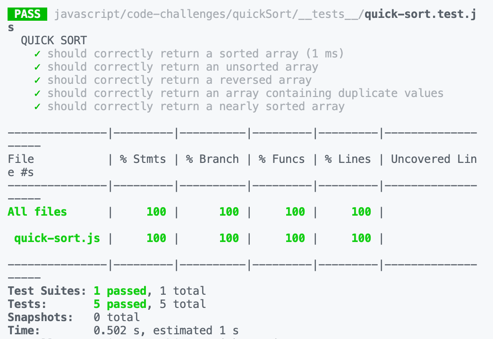

# Quick Sort

Quicksort works as a "divide and conquer" sorting algorithm, breaking up a given list of items on a "pivot" value, then sorting the items in the sub-array relative to that pivot. Using recursion, iteratively smaller sub-arrays are divided, allowing the algorithm to sort in-place, using a small memory footprint.

## PseudoCode

## Benefits

In practice, quicksort outpreforms merge sort even though it's worst-case scenario time complexity is worse.

