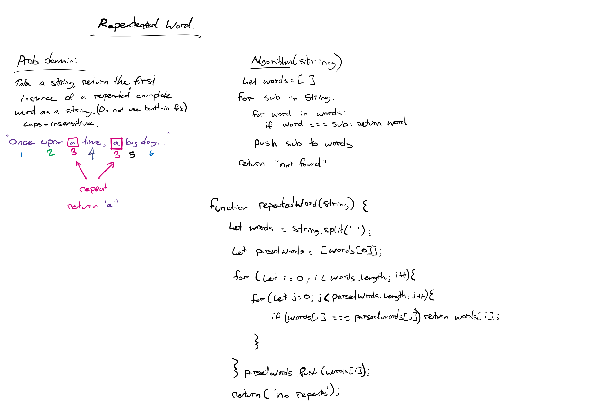
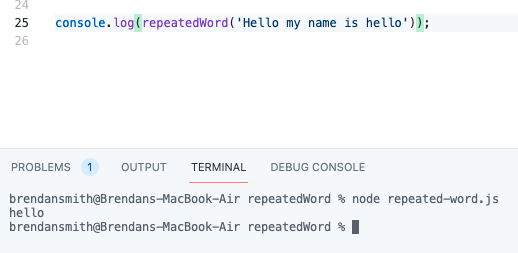

# Repeated Word
<!-- Description of the challenge -->
Write a function that accepts a lengthy string parameter.

Without utilizing any of the built-in library methods available to your language, return the first word to occur more than once in that provided string.

**Stretch goals:**

Modify your function to return a count of each of the words in the provided string

Modify your function to return a list of the words most frequently used in the provided string

## Whiteboard Process
<!-- Embedded whiteboard image -->

## Approach & Efficiency
<!-- What approach did you take? Why? What is the Big O space/time for this approach? -->
I used a nested for loop to compare the current word in the string with an array of 'parsed words' that have already been checked. This results in a simple function with an O(n^2) worst-case scenario. 

## Solution
<!-- Show how to run your code, and examples of it in action -->

