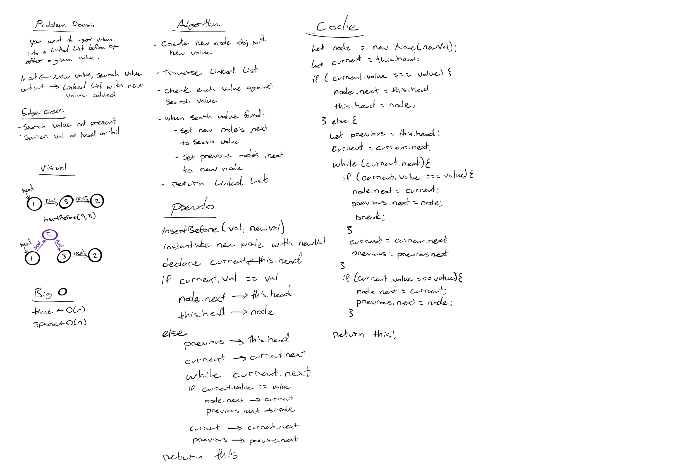

# Challenge Summary
<!-- Short summary or background information -->
`append(value)` which adds a new node with the given value to the end of the list

`insertBefore(value, newVal)` which add a new node with the given newValue immediately before the first value node

`insertAfter(value, newVal)` which add a new node with the given newValue immediately after the first value node

## Challenge Description
<!-- Description of the challenge -->

write functions that can insert a node into a linked list either before, after, or at the end of other nodes in the list.

## Approach & Efficiency
<!-- What approach did you take? Why? What is the Big O space/time for this approach? -->
time: O(n)

space: O(n)

## Solution
<!-- Embedded whiteboard image -->

